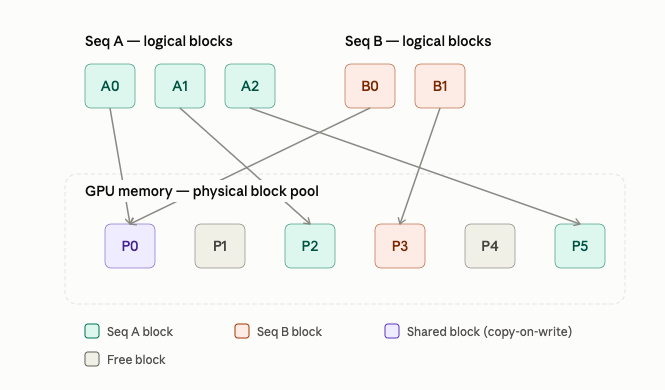

# Inference Optimizations

Every optimization in LLM serving is really a negotiation with one fact: **the KV cache**. During autoregressive generation, each new token needs the key/value vectors of every prior token to compute attention. Recomputing those from scratch at every step would be wasteful, so systems cache them layer by layer as they're produced. That cache grows linearly with sequence length and batch size, and for a mid-size model a few thousand tokens of context can already mean gigabytes of cache — per sequence.

This creates two separate headaches for a serving system:

- **A memory problem** — how do you pack many concurrent, growing, unpredictably-sized caches into fixed GPU memory without wasting most of it?
- **A scheduling problem** — requests arrive and finish at different times (output length isn't known in advance), so how do you keep the GPU busy instead of stalling on whichever sequence in the batch happens to be slowest?

Continuous batching answers the second. PagedAttention answers the first.

### Continuous batching (the scheduling problem)

The naive approach — **static batching** — groups a fixed set of requests, runs the forward pass repeatedly until _every_ sequence in the batch has finished, then swaps in a new batch. The catch: output lengths vary enormously. If one request in a batch of eight wants 500 tokens and the rest are done at 30, the GPU spends most of its time computing padding for finished slots, or sitting idle — because it can't accept new work until the whole batch retires together.

**Continuous batching** (introduced as "iteration-level scheduling" in the Orca paper) fixes this by scheduling at the level of individual generation steps rather than whole requests. After every single token is generated for the batch, the scheduler checks: has any sequence finished? Evict it, free its slot. Is anything new waiting? Slot it in immediately. The batch composition is fluid, iteration to iteration, rather than fixed for the batch's lifetime.

  

The gray blocks in the top panel are pure waste — GPU cycles reserved but doing nothing, purely because static batching can't admit new work until the entire cohort finishes. Continuous batching turns that into pure throughput.

One nuance worth knowing: generation has two phases with very different compute profiles. **Prefill** processes an entire prompt in one pass (compute-bound, parallelizable across all prompt tokens at once). **Decode** generates one token at a time, and each step has to re-read the _entire_ KV cache from GPU memory just to produce a single new token — so decode is memory-bandwidth-bound, not compute-bound. Naively splicing a new request's prefill into a continuous batch stalls all the in-flight decode steps, because prefill is comparatively expensive per step. Production systems handle this with tricks like **chunked prefill** (splitting a long prompt's prefill into smaller pieces interleaved with ongoing decode steps, as in Sarathi-Serve) or **prefill/decode disaggregation** (running the two phases on physically separate GPU pools, as in DistServe and Splitwise), so the two workloads don't compete for the same iteration.

### PagedAttention (the memory problem)

Before PagedAttention, serving systems allocated each request's KV cache as one _contiguous_ chunk of GPU memory, sized for the maximum possible sequence length. This is expensive in a way that's easy to underestimate:

- **Internal fragmentation** — you reserve for the worst case, but most requests finish well short of it, so the unused tail of that reservation is wasted for the request's entire lifetime.
- **External fragmentation** — as differently-sized reservations come and go, free memory gets chopped into pieces too small to satisfy new requests, even when the total free memory would suffice.
- **No sharing** — beam search or parallel sampling from the same prompt needs multiple candidate sequences that share an identical prefix, but contiguous allocation forces each candidate to hold its own full duplicate of that prefix's cache.

The vLLM paper measured that with this approach, only 20–40% of allocated KV cache memory typically held real tokens — the rest was reservation waste.

**PagedAttention** borrows the fix operating systems use for the analogous problem: virtual memory paging. Instead of one contiguous reservation, a sequence's KV cache is split into fixed-size **blocks** (e.g., 16 tokens' worth of K/V each). These blocks can live anywhere in GPU memory — a **block table** (functionally a page table) maps each sequence's logical block index to wherever its data actually sits physically. A custom attention kernel reads through that indirection layer to gather the right K/V blocks when computing attention, instead of assuming everything is laid out contiguously.

  

A few things to notice there: logical block order has nothing to do with physical order — A1 lands in P2, A2 lands way over in P5. That indirection is exactly what eliminates fragmentation: a sequence never needs contiguous physical space, so you only ever waste at most one partially-filled block per sequence (the loss shrinks to near zero rather than "whatever's left of a max-length reservation"). And because A0 and B0 both point at P0, two sequences with a shared prefix (say, from beam search or parallel sampling of the same prompt) store it exactly once. If one of them then generates a divergent token, that's handled with **copy-on-write** — same trick as OS process forking — allocating a fresh block for the diverging sequence only when it actually writes something new.

The payoff reported in the vLLM paper: memory waste drops from that 60–80% range down to under 4%, which directly translates into more concurrent sequences fitting in the same GPU — and since batch size is usually the throughput lever, that's roughly a 2–4x throughput gain over prior systems, with the gap widening for longer sequences and more complex decoding (beam search, parallel sampling) where the sharing benefit compounds.
